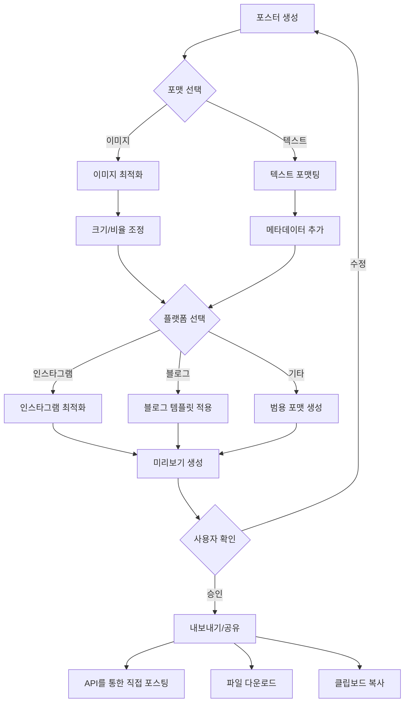

<p align="center">
  <a href="" rel="noopener">
 </a>
</p>

<h3 align="center">TravelLogAI ( 임시 ) </h3>

<div align="center">

[]()
[](https://github.com/yourusername/TravelLogAI/issues)
[](https://github.com/yourusername/TravelLogAI/pulls)
[](/LICENSE)

</div>

---

<p align="center"> TravelLogAI는 여행 사진을 AI로 분석하여 자동으로 여행 경로를 시각화하고 블로그 포스트를 생성하는 서비스입니다.
    <br> 
</p>

## 📝 목차

- [소개](#about)
- [시작하기](#getting_started)
- [사용 방법](#usage)
- [배포](#deployment)
- [기술 스택](#built_using)
- [기여하기](../CONTRIBUTING.md)
- [개발자](#authors)
- [감사의 글](#acknowledgement)

## 🧐 소개 <a name = "about"></a>

TravelLogAI는 여행자들을 위한 혁신적인 플랫폼입니다. 사용자가 여행 사진을 업로드하면, 인공지능이 이를 분석하여 자동으로 여행 경로를 지도에 시각화하고, 멋진 블로그 포스트를 작성해줍니다. 이를 통해 사용자는 손쉽게 자신의 여행 경험을 기록하고 공유할 수 있습니다.

## 🔄 포스터 생성 프로세스



## 🏁 시작하기 <a name = "getting_started"></a>

이 지침을 따라 로컬 시스템에서 프로젝트를 실행하고 개발할 수 있습니다.

### 필요 조건

프로젝트를 실행하기 위해 필요한 소프트웨어와 라이브러리:

  ```
  Python 3.7 이상
  Node.js v14.0.0 이상
  npm v6.0.0 이상
  ```

### 설치

프로젝트를 로컬 환경에서 실행하는 단계:

1. 리포지토리를 클론합니다

    ```
    git clone https://github.com/yourusername/TravelLogAI.git
    ```

2. 백엔드 설정:

    ```
    cd TravelLogAI/backend
    python -m venv venv
    source venv/bin/activate  # Windows의 경우: venv\Scripts\activate
    pip install -r requirements.txt
    ```

3. 프론트엔드 설정:

    ```
    cd ../frontend
    npm install
    ```

4. 백엔드 서버 실행:

    ```
    cd ../backend
    uvicorn main:app --reload
    ```

5. 새 터미널에서 프론트엔드 개발 서버 실행:

    ```
    cd TravelLogAI/frontend
    npm start
    ```

이제 브라우저에서 `http://localhost:3000`으로 접속하여 애플리케이션을 확인할 수 있습니다. 백엔드 API는 `http://localhost:8000`에서 실행됩니다.

## 🎈 사용 방법 <a name="usage"></a>

1. 회원가입 후 로그인합니다.
2. '일정 생성하기' 버튼을 클릭하여 새 여행을 시작합니다.
3. 여행 사진을 업로드합니다.
4. AI가 사진을 분석하고 여행 경로를 생성할 때까지 기다립니다.
5. 생성된 블로그 포스트를 검토하고 필요한 경우 편집합니다.
6. '게시하기' 버튼을 클릭하여 여행 기록을 공유합니다.

## 🚀 배포 <a name = "deployment"></a>

이 프로젝트를 실제 서버에 배포하는 방법:

1. 프론트엔드 빌드를 생성합니다:

    ```
    cd frontend
    npm run build
    ```

2. 백엔드 배포를 위해 Gunicorn을 설치합니다:

    ```
    pip install gunicorn
    ```

3. 백엔드를 실행합니다:

    ```
    gunicorn -w 4 -k uvicorn.workers.UvicornWorker main:app
    ```

4. Nginx나 Apache를 사용하여 프론트엔드 빌드 파일을 서브하고, 백엔드 API로 요청을 프록시합니다.

## ⛏️ 기술 스택 <a name = "built_using"></a>

- [MongoDB](https://www.mongodb.com/) - 데이터베이스
- [FastAPI](https://fastapi.tiangolo.com/) - 백엔드 프레임워크
- [React](https://reactjs.org/) - 프론트엔드 프레임워크
- [Python](https://www.python.org/) - 백엔드 언어
- [TensorFlow](https://www.tensorflow.org/) - AI 모델

## ✍️ 개발자 <a name = "authors"></a>

- [@duckgeunpark](https://github.com/duckgeunpark) - 아이디어 및 초기 작업
## 🎉 감사의 글 <a name = "acknowledgement"></a>

- 오픈 소스 커뮤니티의 모든 분들께 감사드립니다.
- 이 프로젝트에 영감을 준 모든 여행 블로거들에게 감사드립니다.